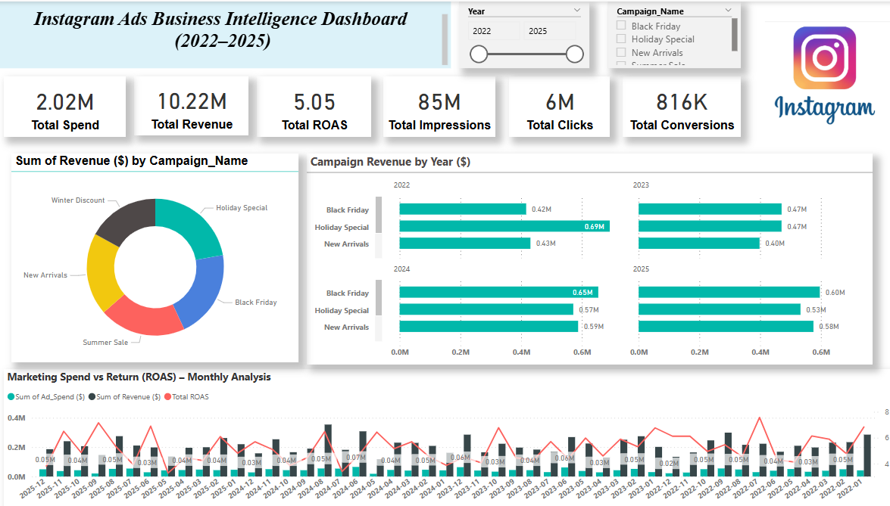

# Power-BI-portfolio

📊 Instagram Ads Business Intelligence Dashboard (2022–2025)
🔍 Overview
This Power BI dashboard provides a comprehensive analysis of Instagram advertising performance from 2022 to 2025, leveraging business intelligence best practices to visualize key marketing KPIs, campaign efficiency, and ROI trends. It was built using a synthetic dataset simulating ad revenue and engagement data.

📌 Key Objectives
Track total ad spend, revenue, and ROAS (Return on Ad Spend)
Analyze individual campaign performance by year
Visualize engagement and conversion efficiency
Identify trends in spend vs return over time
Enable interactive filtering by year and campaign
📈 Features
✅ KPI Cards
Total Spend
Total Revenue
ROAS (Return on Ad Spend)
Total Impressions
Total Clicks
Total Conversions
These offer a quick-glance summary of overall marketing performance.

📊 Donut Chart – Revenue by Campaign
Shows the contribution of each campaign to total revenue.
Offers a visual distribution of campaign performance.
📊 Bar Chart with Small Multiples – Campaign Revenue by Year
Displays annual revenue breakdown by campaign.
Small multiples help easily compare trends across years.
📉 Line and Clustered Column Chart – Marketing Spend vs ROAS (Monthly Analysis)
Revenue and Spend shown as columns
ROAS trend shown as a line
Helps identify months with high spend but low efficiency
🎛️ Slicers (Filters)
Year Range Selector
Campaign Name Selector
These allow interactive exploration of the data by time period and campaign.

📂 Data Source
This dashboard is built on a synthetic Instagram Ad Revenue dataset (2022–2025) which includes:

Campaign names
Dates
Ad Spend
Revenue
Impressions, Clicks, Conversions
Engagements
Calculated ROAS
🧰 Tools Used
Power BI Desktop
DAX (for custom KPIs: ROAS, Spend, Revenue)
Power Query (for date formatting and time-based grouping)
Data Visualization best practices
🧠 Learnings
How to apply BI principles to marketing data
Combining time-series analysis with campaign comparison
Using small multiples and combo charts for deeper insights
Formatting and layout techniques for executive dashboards
